# 방구석 세계속으로

## 조 / 컨셉 소개 

### 조 소개 :two: :zero: :zero: %

**2보나와 100경원** , 조 구성원의 성을 조합해 200% 라는 조 이름을 정하게 되었습니다. 각자 100%의 역량을 발휘해 200%의 결과물을 만들어내자는 중의적인 의미도 담고 있습니다.

### 컨셉 소개 :airplane:

영화를 통해 세계를 여행한다는 의미를 담아 영화 인문학 토크 프로그램 '방구석 1열'과 여행 시사교양 프로그램 '걸어서 세계속으로'를 합쳐 **'방구석 세계속으로'** 라는 서비스를 기획했습니다.

영화 제작 국가가 아닌 영화 배경지를 기반으로 이용자가 떠나고 싶은 나라를 배경으로 한 영화를 추천해주는 서비스입니다. 

### 일정 소개 :calendar:

## ERD 

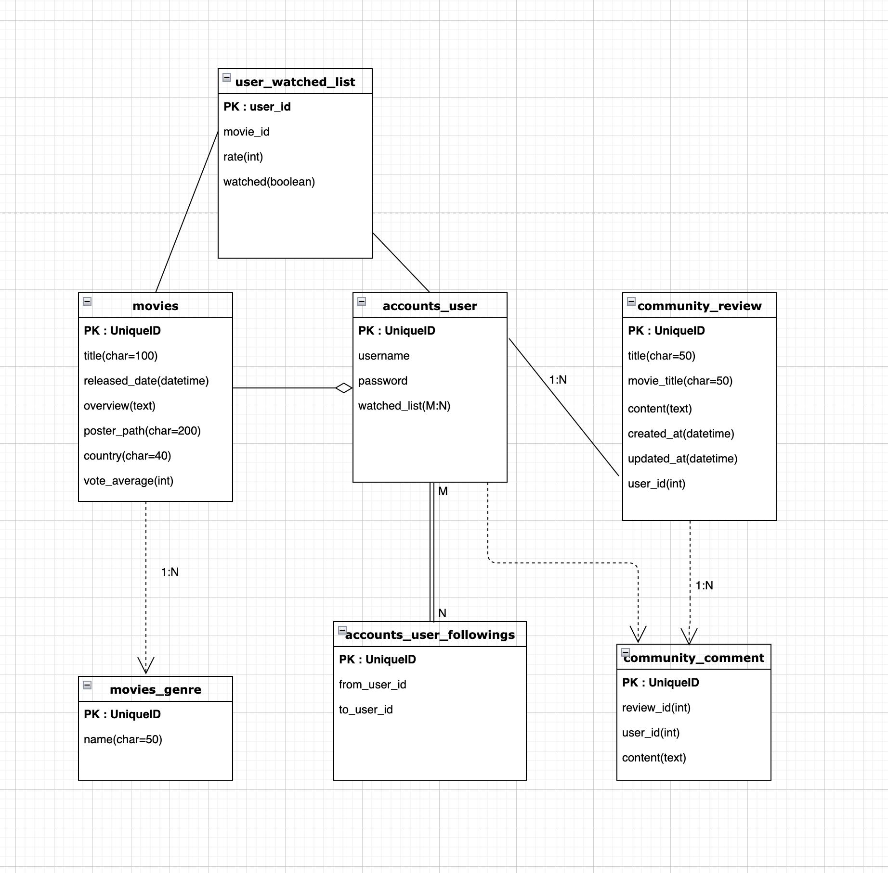

1. account
   - 프로필에서 해당 이용자가 이미 관람한 영화를 보여주기 때문에 watched_list 항목을 추가해 movies 모델을 참조해주었습니다.
   - Follow 기능 구현을 위해 followings라는 중개테이블을 만들어 user 모델 내에서 M:N 관계를 설정했습니다.
2. Community
   - review에 코멘트를 작성하기 위해 comment 모델을 만들어 review모델과 연결했습니다.
   - Review 좋아요 기능 구현을 위해 (이미지에는 나타나 있지 않지만) review 모델에 like_user 항목을 추가해 user 모델과 review 모델을 연결했습니다.
3. Movie
   - 영화의 배경지를 DB에 저장해야 하기 때문에 관련 정보를 추가했습니다.

## 기능

### 메인 페이지  🚞

총 세개의 슬라이드로 구성되어 있으며, 세 페이지를 프레임워크 swiper를 통해 연결했습니다. 마우스 휠을 통해 상하 슬라이드로 이동할 수 있으며, 페이지네이션을 통해 현재 위치를 파악할 수 있습니다.

#### 메인 페이지 1 - 목적지 검색 :mag:

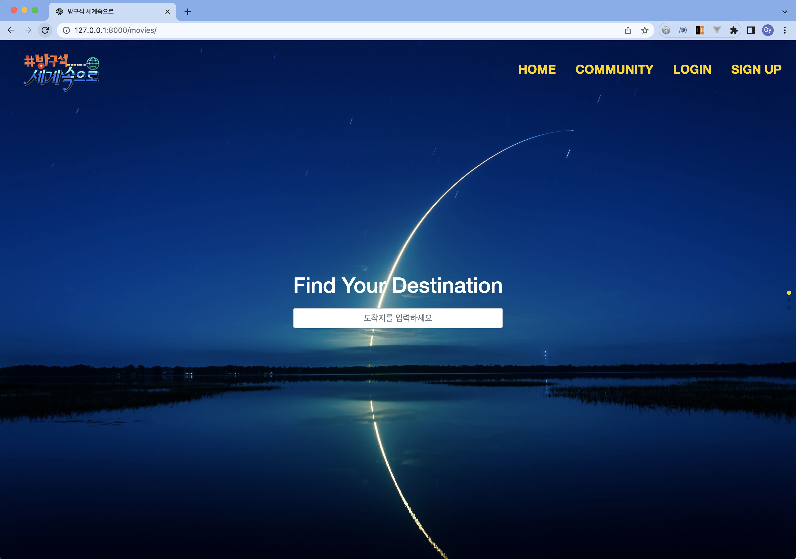

- 도착지를 입력 후, 엔터 버튼을 누르면 검색결과로 이동합니다.
- 새로고침 시, 배경이 랜덤하게 변경됩니다.

#### 메인 페이지 2 - 여행지 추천 🗽

- 떠나고 싶은 나라를 선택하지 못한 이용자에게 선택지를 제공 및 추천 합니다.
- 'Go to ~' 버튼을 클릭하면 해당 도시를 배경으로 한 영화 리스트가 제공됩니다.

#### 메인 페이지 3 - 패키지 추천 :gift:

- 패키지 영화를 추천합니다.

### 영화 :clapper:

#### Movie List :card_file_box:

- 검색한 나라에 따라 해당 국가의 인사가 나타나게 구성되어 있습니다.
- 페이지 당 12개의 영화가 보여지며, 페이지네이션을 활용해 앞 뒤 페이지로 이동할 수 있습니다.

#### Movie Detail :movie_camera:

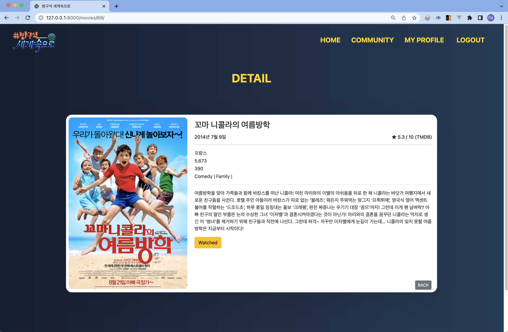

- 영화 정보가 적힌 카드 형태로 구성되어 있습니다.
- 이미 본 영화는 Watched 버튼을 누르면 profile에서 확인할 수 있습니다.

### Community :speech_balloon:

#### Review List :notebook:

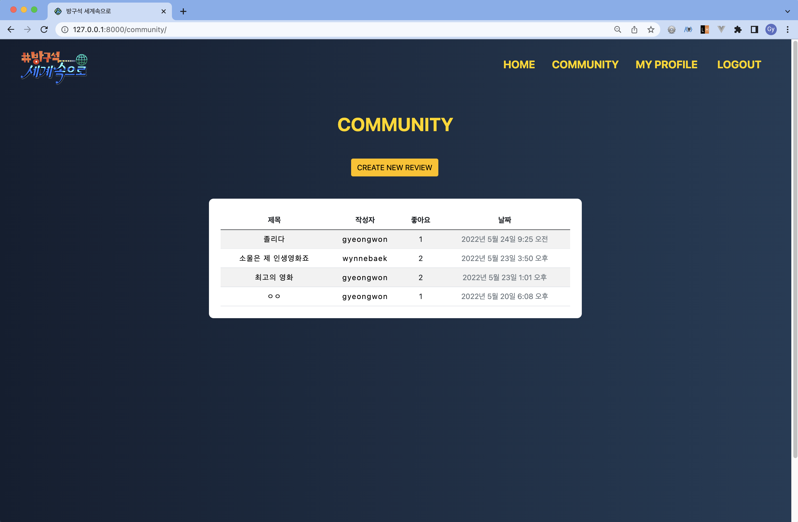

- 현재 작성된 리뷰가 table 형태로 구성되어 있습니다.
- 각 리뷰의 제목을 누르면 해당 리뷰의 상세 페이지로 이동합니다.

#### Review Detail :page_facing_up:

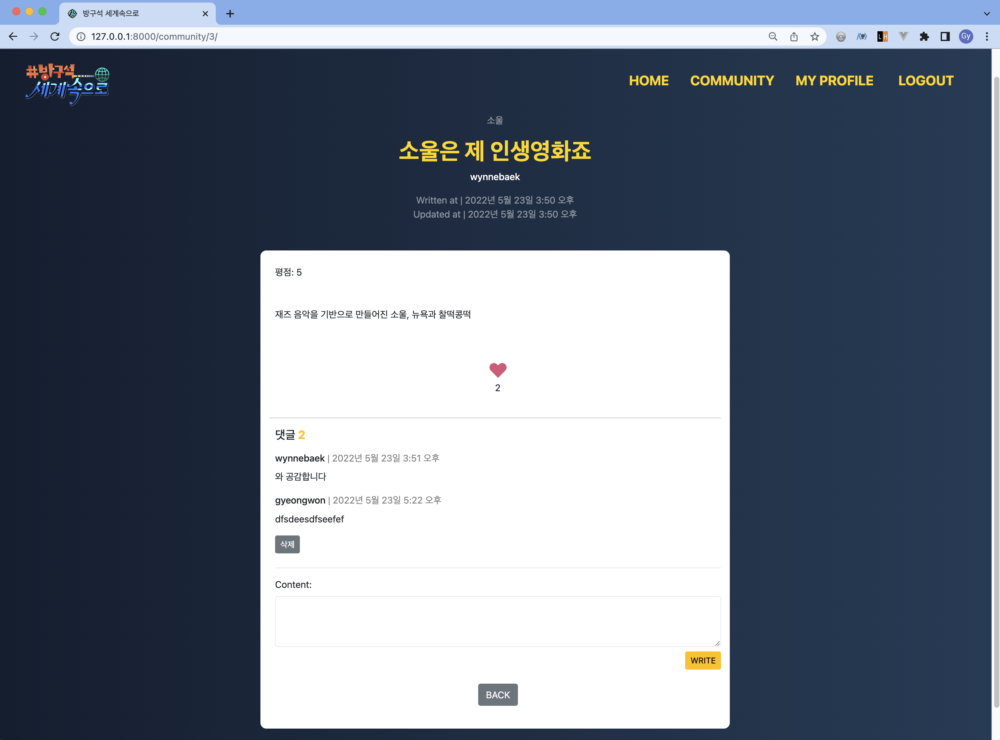

- 영화제목, 리뷰제목, 작성자, 작성일, 수정일 / 평점, 상세 내용, 좋아요 버튼, 댓글, 댓글 작성 form 으로 구성되어 있습니다.
- 하트 버튼을 누르면 새로고침 없이 POST 요청을 수행합니다.
- 댓글 작성자만 본인의 댓글을 삭제할 수 있습니다.

#### Review 작성 :black_nib:

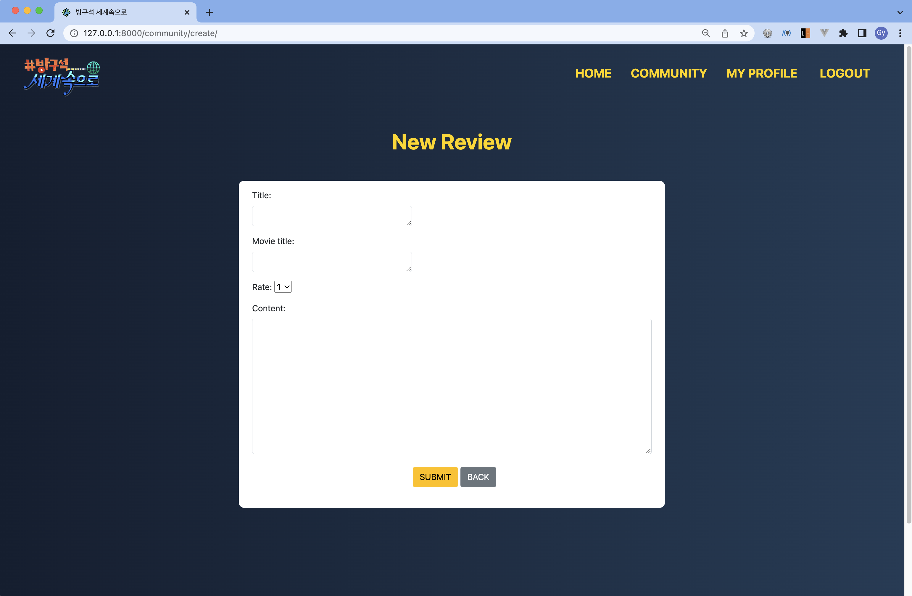

- 리뷰 제목, 영화제목, 평점, 상세내용을 작성할 수 있는 form을 제공합니다.

#### Review 수정

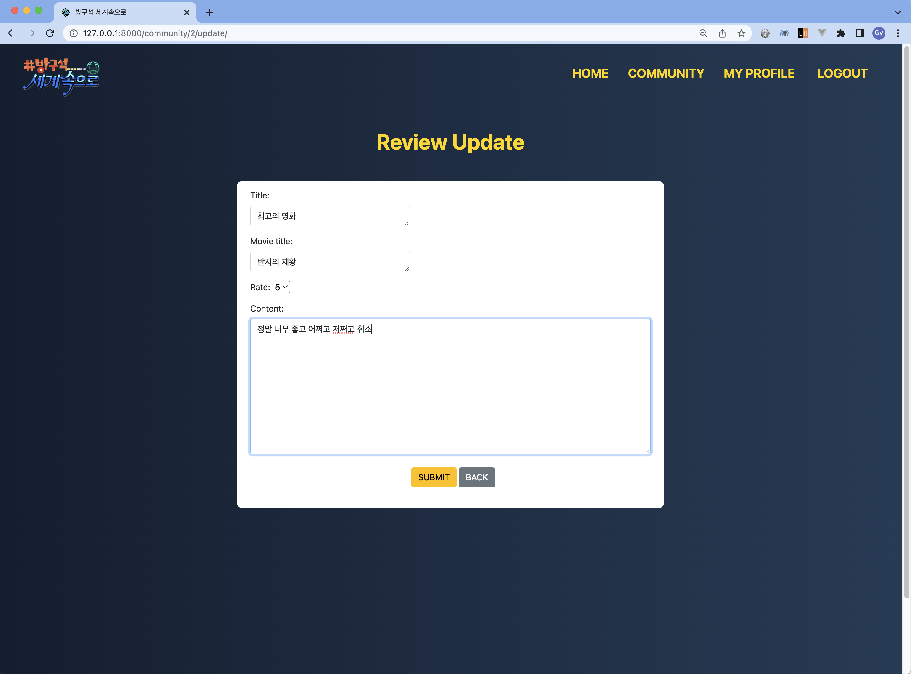

- 작성한 리뷰를 수정할 수 있습니다.

### Account :bust_in_silhouette:

#### 회원가입

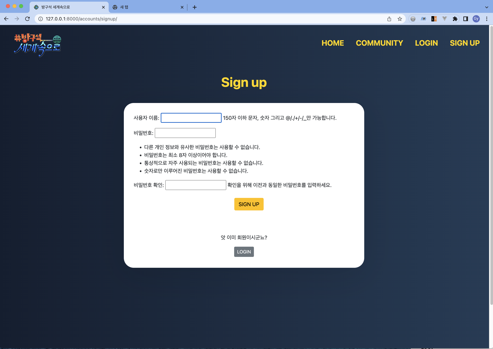

- 회원가입 form을 통해 가입할 수 있습니다.

#### 로그인

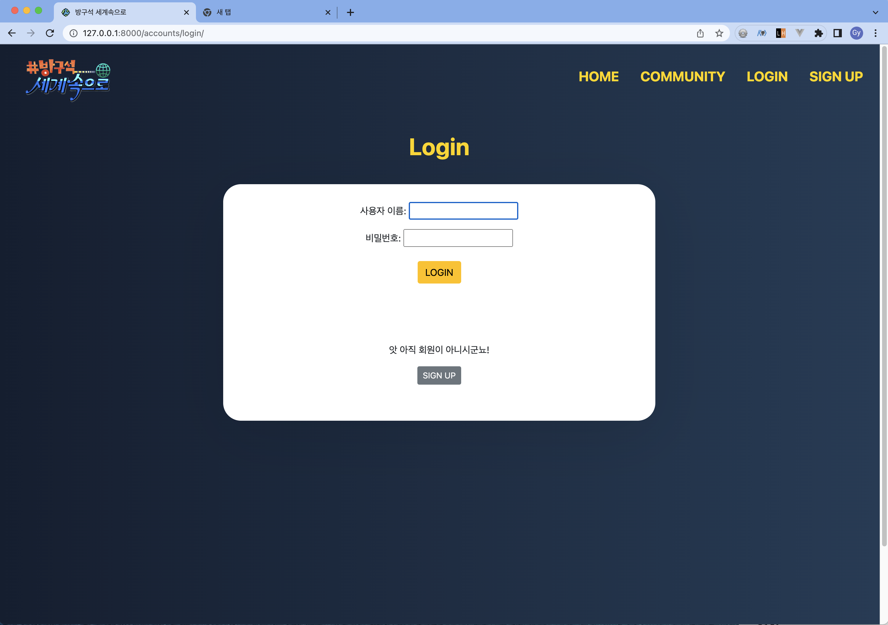

- 가입한 회원은 로그인 기능을 사용할 수 있습니다.

#### 프로필 

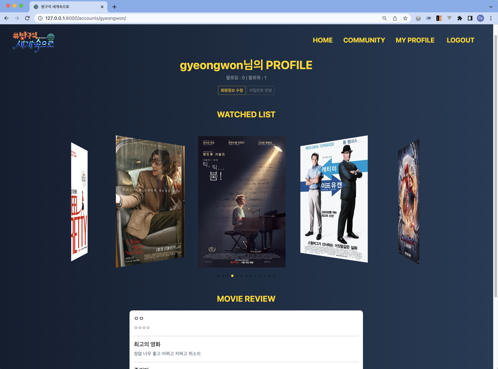

- Movie Detail 페이지에서 watched 체크한 영화를 프로필에서 확인할 수 있습니다.
- profile의 유저가 작성한 리뷰를 확인할 수 있습니다.

#### 회원정보 수정

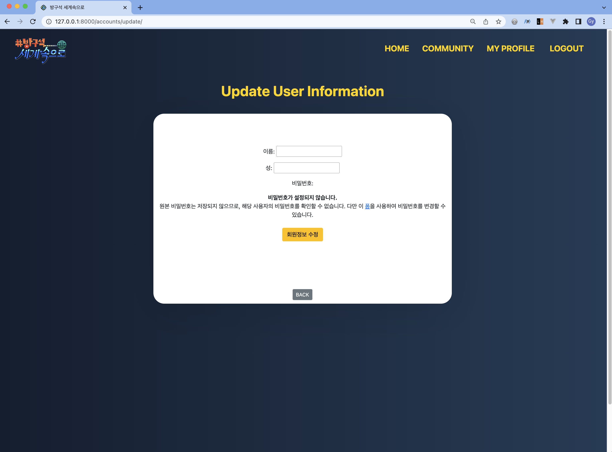

- 회원 정보를 수정할 수 있습니다.

#### 비밀번호 변경

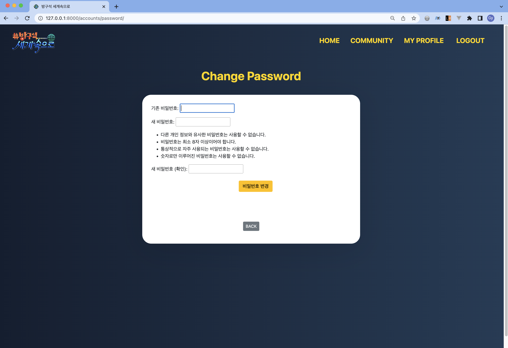

- 비밀번호를 변경할 수 있습니다.

## 느낀 점

### 백경원

5개월 동안 배운 내용을 하나의 결과물로 만들어내는 관통 프로젝트가 끝이 났습니다. 전반적으로 큰 갈등과 문제 없이 원활하게 프로젝트를 끝낼 수 있었고, 그 과정에는 팀원과의 협동이 가장 큰 역할을 한 것 같습니다. 기획부터 와이드 프레임, 개발까지 모든 과정을 함께 논의하며 진행했기 때문에 큰 문제 없이 프로젝트를 끝낼 수 있었습니다. 

기술적 어려움을 겪기도 했고, 내 뜻대로 되지 않는 디자인과 기능 구현에 스트레스를 받기도 했습니다. 원하는 기능을 구현하기 위해 수십 개의 게시물을 읽으며 코드에 적용하는 과정에서 5개월 동안 학습한 양 만큼 성장했다는 것을 느낄 수 있었습니다. 방학 기간 동안 다양한 기능을 추가하고 배포까지 할 수 있다면 더할 나위 없을 것 같습니다!

### 이보나

ssafy 과정 동안 존재만으로도 가장 큰 스트레스였던 최종프로젝트였는데, 좋은 페어분을 만나 무사히 잘 끝났습니다. 9시부터 6시까지 항상 함께 개발하면서, 많은 소통이 도움이 되었던 것 같습니다. 
ssafy에서 학습한 내용들을 직접 소화하면서, '그동안 많은 것을 배웠구나', '그때 더 열심히 할걸..ㅠ' 하는 생각도 들었습니다. 계절학기와 2학기에서는 더욱 성실한 학생이 되려고 합니다! 비록 짧았지만, 목표를 가지고 함께 무언가를 해내는 과정이 즐거웠습니다. 오늘의 성취가 앞으로의 페어분과 저의 모든 일에 원동력으로 작용했으면 좋겠습니다. 